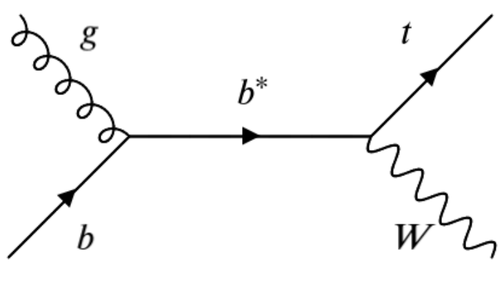

## Introductions

First we can begin with some introductions. The facilitators are: 
- Johan Sebastian Bonilla Castro, Postdoc at the University of California -- Davis, they work on all-hadronic VLQ and ttbar resonance searches as well as CSC upgrades.
- Lucas Corcodilos, Graduate Student at John Hopkins University, he works on an all-hadronic b*->tW search. 
- John C. Hakala, Postdoc at the University of Virginia, he works on a leptophobic Z’ cascade decay search.
- Brendan Regnery, Graduate Student at the University of California -- Davis, he works on an all=hadronic VLQ search and GEM upgrades. 

The team members are:
- Elham Khazaie, PhD student at Isfahan University of Technology, Iran, working on the search for an exotic decay of the Higgs boson, also working on Luminosity Calibration.
- Davide Bruschini, Master's Student at the University of Pisa - Currently working on the search for EW photon+2 jets events (VBF to photon) at CMS
- Elham Khazaie, PhD student at Isfahan University of Technology, Iran, working on the search for an exotic decay of the Higgs boson, also working on Luminosity   Calibration.
- Florian Eble, PhD student at ETH Zurich, working on Dark Matter search by looking for Semi-Visible Jets, also working on luminosity in BRIL.
- Yusuf Can Cekmecelioglu, Masters Student at Bogazici Univeristy, Istanbul -- Currently working on back-end of the HGCal detector.
- Federica Riti, PhD student at ETH Zurich, she works on the search for lepton flavour universality violation via the R(J/psi) measurement.
- Kaustuv Datta, PhD student at ETH Zurich, working on measurements of bases of N-subjettiness observables to map out the phase space of emissions in light jets, and jets originating from different boosted hadronic decays.    

The overall goal of this long exercise is to offer everyone a high-level exposure of the different components of a physics analysis. In practice, carrying out an analysis takes months and often past a year; we hope to cover the key points of the process and won't have too much time to do so. To help you through the material, we will be providing some useful code for your use. We strongly suggest you focus on understanding the conceptual flow of the analysis and to ask as many questions as you'd like. We also encourage that you get creative and challenge yourself! If there are any parts of the exercise that you feel you can tackle by writing your own scripts, or optimizing ours, please do! We are all collaborators and we can learn a lot from each other.

## Using Git

Before moving on, let's all get on the same page and test that our workspaces have the packages they need. In the above menu bar, click on Setup and follow the instructions there.

Next, fork+clone the exercise's repositories. Bookmark the [website GitHub repository](https://github.com/CMSDAS/b2g-long-exercise) and the [code repository on GitLab](https://gitlab.cern.ch/cms-b2g/b2g-long-exercise-code). When you navigate to both of these websites, click on the 'Fork' button towards the top-right of the page. (You will need to be logged into your GitHub/GitLab accounts)

> ## Question: What is the difference between GitHub and GitLab
>
> You may have noticed that the code repositories hosting the tutorial info and the analysis code used in this exercise use different services (GitHub vs GitLab). Why is this the case?
>
> > ## Solution
> >
> > GitHub is completely public, whereas GitLab is maintained by CERN and requires credential to host projects. 
> > Depending on the needs of the project you are working on, you may want the public nature of GitLab or the speciic tools of GitLab.
> > For example, GitLab's CI/CD has additional features that are specifically useful to developing analysis software.
> {: .solution}
{: .challenge}

*Include instructions on how to make sure environment is good to go*

Now that you have forked the code onto your personal project space, let's clone your repository onto your working directory and while we're at it also set the upstreams:
~~~bash
ssh -Y <LPCUsername>@cmslpc-sl7.fnal.gov
cd ~/nobackup
mkdir CMSVDAS2020
git clone https://github.com/<GitHubUsername>/b2g-long-exercise.git <nameYourTutorialPackage>
cd <nameYourTutorialPackage>
git remote add upstream https://github.com/CMSDAS/b2g-long-exercise.git
git remote -v
cd ..
git clone https://gitlab.cern.ch/<GitLabUsername>/b2g-long-exercise-code.git <nameYourCodePackage>
cd <nameYourCodePackage>
git remote add upstream https://gitlab.cern.ch/cms-b2g/b2g-long-exercise-code.git
git remote -v
cd ..
ls .
~~~
{: .source}

Now our code is ready to be worked on. 

## Good Software Development Habits
Let's take a few minutes to think about working on software projects as a colloboration. The code you run today (and tomorrow) has been developed by *thousands* of folks like you trying to make everyone's life slightly easier. You will probably spend a lot of time reading other people's code and will quickly build a standard on what 'good code' looks like. Similarly when working as a group on a common piece of software, we find good and bad ways to make changes. 

To combat these problems, we agree to have a set of 'good-practices' for keeping software clean and easy to interpret. First, is the use of comments. When developing a script, begin by stating the code's intended purpose and a general roadmap to the file. For each function you define (and also important data structures), include in-line comments explaining clearly what the functions/objects are used for. When making commits and merge requests on git, add detailed comments (think about having to sort through dozens of undescribed commits months after pushing them).

Version control is a way of tracing the history of software projects by recording changes encoded in 'commits/pushes'. We will be using GitHub and CERN's GitLab to develop our code. CI/CD (Continuous Integrationa and Deployment) is a technique for developing tests on changes (pushes) to the repository. One can, for example, create a test that compiles the code and returns and error if it cannot; one can also create tests for enforcing code style, or execute sample runs of analysis code. The sky is the limit for how fancy you want to make your CI/CD. What do you think should be implemented for our code?

## "Homework" (, or bonus part of the lesson)
You should have already forked and cloned your personal version of the repository generating this website. By forking the repository, you have made your own copy of the code which generates a copy of this website, which means you have a tutorial website of your own! (Assuming you haven't already developed a website with GitHub) To check out your website, go to https://GitHubUsername.github.io/b2g-long-exercise/
 
In the introduction section at the top of the lesson, you may remember there was a 'TBA' space in the (empty) list of participants. The goal of the following execise is to populate that list with brief introductions to you all, by changes you make to your local fork that you will then request to merge into the main website. 

The general steps to follow here are:
- (Before developing) Ensure the code you have is up-to-date with 

~~~bash
cd ~/nobackup/CMSVDAS2020/<nameYourTutorialPackage>
git fetch --all
<Enter credentials, (if any) new branches/tags will be made available>
git merge upstream gh-pages
git checkout -b <nameNewBranch>
git branch -v
<Develop code>
git status
git add <fileChanged>
git commit -m 'Write a message describing change'
git push -u origin <nameNewBranch>
<Make Merge(Pull) Request through browser onto main b2g-long-exercises repo>
~~~
{: .source}

- (If already developed, but changes in upstream branch) You may have to rebase your changes on top of upstream commit.

~~~bash
cd ~/nobackup/CMSVDAS2020/<nameYourTutorialPackage>
<Previous code development>
git branch -v
<If no branch created> git checkout -b <nameNewBranch>
git status
git add <fileChanged>
git commit -m 'Write a message describing change'
git fetch --all
<Enter credentials, new branches/tags are made available>
git rebase upstream gh-pages
git push -u origin <nameNewBranch>
<Make Merge(Pull) Request through browser onto main b2g-long-exercises repo>
~~~
{: .source}

Check your websites to make sure the changes look like what you want, it may take a few minutes for the build to update on the site. You can request a pull request through your repository page on GitHub. Before finishing this part of the episode, make sure all repositories are up to date and have the correct latest commit:

~~~bash
cd ~/nobackup/CMSVDAS2020/<nameYourTutorialPackage>
git remote -v
git branch -v
~~~
{: .source}

If you do not feel comfortable with git yet, that is ok. This is a learning experience and what we hope you get out of this is being conviced that proper use of versioning is useful when working in a collaboration like CMS. Ask your facilitators for help if you feel stuck, whatever the problem may be, the point of these exercises is to give you 'big picture' experiences not coding challenges.

## The All-Hadronic b*->tW final state
The b* resonance is a beyond the standard model (BSM) particle that can be produced at the LHC when a b-quark from the incoming proton's quark-sea interacts with a gluon from the other proton to form an excited resonance that decays to a top-quark and W-boson. The top quark almost always decayse to t->b+W, thus in the final state we have a jet from a b-decay with the W decay jets from the top and the prompt W from the b* decay. It is then the decay channels of the W bosons that determine the final state of the process. In this exercise we will focus on the all-hadronic channel.

 

In upcoming episodes we will investigate in detail the topology of our signal, as well as possible background standard model (SM) processes that we must model and estimate their expected rates for our search.
