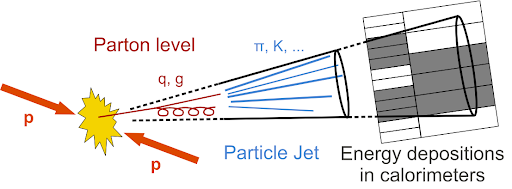
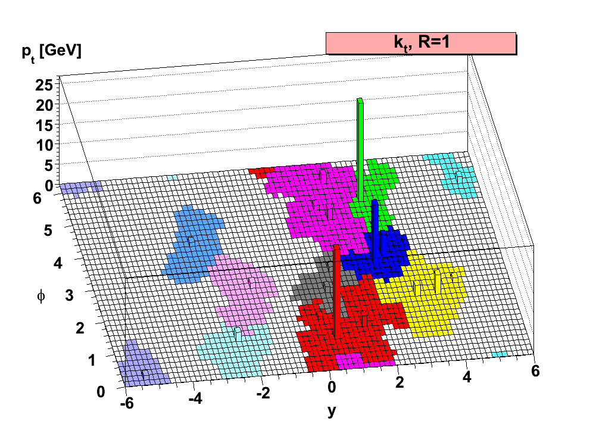

## Jets

After collision, colored particles (with a lifetime longer than the hadronization time scale, i.e. not tops) form cone-like hadronic showers as they propagate away from the interaction point. In experiment, we can only see the interactions of the 'stable' particles (pions, kaons, etc.) with the detectors, which are on average 2/3 charged particles. The calorimeters measure the energy deposits of these partilces, but we have to decide how to combine those energy deposits to best reconstruct the final state partons. In CMS, we use the Particle Flow technique to define PF candidates which we then cluster into jets. 

When analyzing hadronic final states, it is important to understand the jet collections used to cluster energy deposited by the hadronic showers of the final state quarks and gluons. The most common jet clustering algorithm, anti-kt, groups together 'softer' (low kT) objects onto harder (high kT) objects recursively until all objects are separated by a distance of the input R-parameter; the R-parameter of a jet defines the maximum radius that it can cluster constituents into itself. Normally, we use R=0.4 to define single-parton jets, e.g. low pT top decays into three separate (resolved) jets. 

Sometimes, we want to capture the entire decay of a heavy object using a larger-R jet. The R-parameter used for these puposes depends on the mass and transverse momentum of the decaying particle, and tends to be between R=0.8-1.2. A good rule of thumb is that the opening angle of a massive particle decaying into much lighter constituents is R<2m/pT.

> ## Question: What is are the opening angles for 200 GeV tops? What about 200 GeV Ws? What if they are at high pT ~ 1TeV?
>
> > ## Solution
> >
> > The useful expression here is R<2m/pT. For a 200 GeV top, R<346/200 -> R<1.73. At the same transverse momentum, a W opens at R<160/200 -> R<0.8. 
> > At 1 TeV, the top decays in a cone of about R<0.35 and for the 1 TeV W it is R<0.16. 
> > As you may notice, high pT heavy (boosted) objects tend to be well encapsulated by R=0.8 jets. But, at very high pT the decaying objects are quite columnated.
> > The choice of R-parameter for your jet collection, in a way, defines the lower bound of the pT you are sensitive to.
> {: .solution}
{: .challenge}

## Jet Substructure

Jet substructure is a family of analysis techniques that studies the detailed structure within jets through the constituents of the object. When we cluster PF candidates into anti-kt jets, we can keep the information of which PF candidate is associated with which anti-kt jet. Afterwards, we can calculate substructure observables with the stored information.
- N-Subjetiness (&tau;N) is a set of observables that quantifies how N-pronged a jet looks like. The definition is in the image below, and it is essentially a pT-weighted moment of the constituent objects with respect to the closest of N subjets. There are many possible ways to defend where the N subjets are to be centered, but the most common is the N highest pT constituents. The observable is normalized such that the observable is always between [0,1] and the closer the result is to 0 the more N-pronged the jet is. [Link to paper](https://arxiv.org/abs/1011.2268)
- &tau;32/&tau;21 is an observable made my taking the ratio of 3-subjetiness to 2-subjetiness (2-subjetiness to 1-subjetiness). &tau32 asks the question how much more 3-pronged vs 2-pronged does this jet look like; &tau;21 asks the question how much more 2-pronged vs 1-pronged does this jet look like. For top decays, we would expect low &tau;32, whereas for W decays are expected to have a low value of &tau;21.
- Energy Correlation Functions are similar to the previous observable in the sense that is uses information from the constituent objects to form an observable to differentiate boosted objects from QCD multi-jet objects. However, it does not require defining subjets, as it defines the observable through pair-wise angles and the energies of the contituents. The closer the value is to 0, the more structure is present in the object. [Link to paper](https://arxiv.org/abs/1305.0007)
- Softdrop mass is not quite a traditional substructre variable, but it is commonly used in conjunction with the above. Soft-drop is a technique of jet grooming, in which constituents of a jet are removed depending on their momenta and distance from the jet's centroid. The assumption is that soft radiation, far from the jet axis, is not likely to be part of the hard parton hadronization and thus dropped. [Link to paper](https://arxiv.org/abs/1402.2657)
- b-discriminant: another not-so-traditional substructure variable that quantifies how likely a jet (or its constituents) contains a b-hadron. This is done by evaluating the secondary vertex information, impact parameters, and other observables that try to identify a b-hadron decay. The higher the number, the more likely it is to contain a b-hadron.

  

Tops decay (almost always) to b+W, and since we are looking at the all-hadronic channel we are dealing with a W that decays to two quarks. Tagging an all-hadronic top is looking for a 3-pronged jet, where one of those prongs has the decay products of a b-hadron, and typically also requiring the presence of a b-hadron decay and a jet mass close to the 173 GeV of the top quark. W bosons are tagged as two pronged jets in a mass window around 80 GeV.

> ## Question: What jet substructure observables do you think could be used to identify our signal?
>
> > ## Solution
> >
> > Since we are looking for both a W and a top, we should consider the jet mass. Since our jets will have prong-ed structure, we should consider the N-subjetiness ratios &tau;32 and &tau;21. In addition, we can use the impact parameter information (through the form of CSV).
> {: .solution}
{: .challenge}

Another way to utilize the constituent information of jets is through the use of Machine Learning models. Below are brief descriptions of some taggers developed within CMS:
- BEST: Multiclassifiers of heavy objects. Boosts PF candidates along jet axis and defines 'Boosted Event Shape' variables to be evaluated on a NN. (WIP: jet images in W/Z/H/t rest frames)
- deepAK8: Multiclasifier of heavy objects. Takes low-level PF candidate and tracking information as input to deep NN. 
- ImageTop: Clasifies all=hadronic top decays. Uses the topology of the PF candidates by making jet images and evaluating them with a CNN.
- ParticleNet: Utilizes a point-cloud approach to representing the PF candidates (as opposed to pixels). Has been shown to classify tops and serve as a quark/gluon discriminant.

## Exercise
Use the time before the lunch break to look into the signal sample provided. One quick way to check out its contents is to open the file in interactive root (turning on bash mode with -b helps open the application faster)

~~~bash
root -b /eos/home-l/lcorcodi/Storage/rootfiles/BprimeLH1200_bstar16.root
.ls
_file0->Print()
~~~
{: .source}

When loaded from start-up, the file is assigned the '_file0' variable; dig into the information available and see what is available for you to use. Try using the plotting script provided to see some distributions:

~~~bash
cd ~/CMSVDAS2020/CMSSW_11_0_1/src/
cmsenv
cd timber-env
source timber-env/bin/activate
cd ../TIMBER
source setup.sh
cd ../BstarToTW_CMSDAS2020
python exercises/ex4.py -y 16
~~~
{: .source}

The very last line calls on the plotting script, and it is using some root files we have already made for y'all. If you would like to change the selections and make the plots, make the appropriate chages to the script and run it with an additional '--select' flag.

Try adding your plots to the B2G-Long-Exercise website through the _extras/figures.md file.
