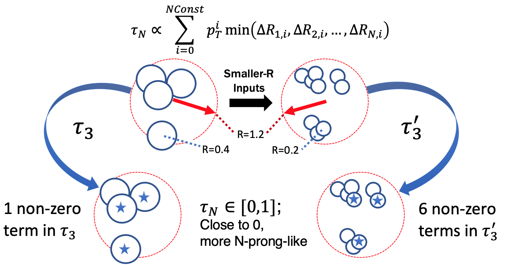

After collision, as a colored particle with a lifetime longer than the hadronization time scale (i.e. not tops) propagates away from the interaction point, the quarks and gluons form hadronic showers which expand in a cone-like fashion. When analyzing hadronic final states, it is important to define the jet collections used to encapsulate the hadronic showers of these colored objects. The most common jet clustering algorithm, anti-kt, groups together 'softer' (low kT) objects onto harder (high kT) objects recursively until all objects are separated by a distance of the input R-parameter; the R-parameter of a jet defines the maximum radius that it can cluster constituents into itself. Normally, we use R=0.4 to define single-parton jets, e.g. low pT top decays into three separate (resolved) jets. 

Sometimes, we want to capture the entire decay of a heavy object using a larger-R jet, the R-parameter used for these puposes depends on the mass and transverse momentum of the decaying particle, and tends to be between R=0.8-1.2. A good rule of thumb is that the opening angle of a massive particle decaying into much lighter constituents is R<2m/pT.

> ## Question: What is are the opening angles for 200 GeV tops? What about 200 GeV Ws? What if they are at high pT ~ 1TeV?
>
> > ## Solution
> >
> > The useful expression here is R<2m/pT. For a 200 GeV top, R<346/200 -> R<1.73. At the same transverse momentum, a W opens at R<160/200 -> R<0.8. 
> > At 1 TeV, the top decays in a cone of about R<0.35 and for the 1 TeV W it is R<0.16. 
> > As you may notice, high pT heavy (boosted) objects tend to be well encapsulated by R=0.8 jets. But, at very high pT the decaying objects are quite columnated.
> > The choice of R-parameter for your jet collection, in a way, defines the lower bound of the pT you are sensitive to.
> {: .solution}
{: .challenge}

Jet substructure is a family of analysis techniques that studies the detailed structure within jets through the constituents of the object. In CMS, we use Particle Flow (PF) objects that we associate as individual hadrons (pions, kaons, etc.). When we cluster PF candidates into anti-kt jets, we can keep the information of which PF candidate is associated with which anti-kt jet. Afterwards, we can calculate substructure observables with the stored information.
- N-Subjetiness (TauN) is a set of observables that quantifies how N-pronged a jet looks like. The definition is in the image below, and it is essentially a pT-weighted moment of the constituent objects with respect to the closest of N subjets. There are many possible ways to defend where the N subjets are to be centered, but the most common is the N highest pT constituents. The observable is normalized such that the observable is always between [0,1] and the closer the result is to 0 the more N-pronged the jet is. [Link to paper](https://arxiv.org/abs/1011.2268)
- Tau32/Tau21 is an observable made my taking the ratio of 3-subjetiness to 2-subjetiness (2-subjetiness to 1-subjetiness). Tau32 asks the question how much more 3-pronged vs 2-pronged does this jet look like; Tau21 asks the question how much more 2-pronged vs 1-pronged does this jet look like. For top decays, we would expect low Tau32, whereas for W decays are expected to have a low value of Tau21.
- Energy Correlation Functions are similar to the previous observable in the sense that is uses information from the constituent objects to form an observable to differentiate boosted objects from QCD multi-jet objects. However, it does not require defining subjets, as it defines the observable through pair-wise angles and the energies of the contituents. The closer the value is to 0, the more structure is present in the object. [Link to paper](https://arxiv.org/abs/1305.0007)
- Softdrop mass is not quite a traditional substructre variable, but it is commonly used in conjunction with the above. Soft-drop is a technique of jet grooming, in which constituents of a jet are removed depending on their momenta and distance from the jet's centroid. The assumption is that soft radiation, far from the jet axis, is not likely to be part of the hard parton hadronization and thus dropped. [Link to paper](https://arxiv.org/abs/1402.2657)
- b-discriminant: another not-so-traditional substructure variable that quantifies how likely a jet (or its constituents) contains a b-hadron. This is done by evaluating the secondary vertex information, impact parameters, and other observables that try to identify a b-hadron decay. The higher the number, the more likely it is to contain a b-hadron.

  
