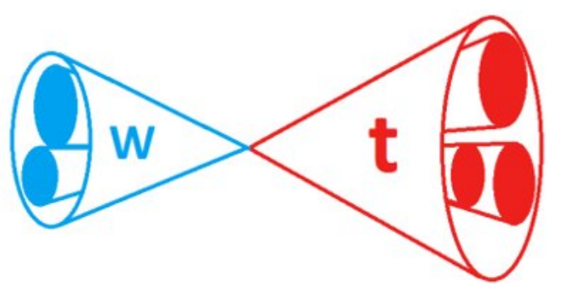

# Introduction

A preselection serves two purposes, first to ensure that passing events only utilize a "good" region of the detector with
appropriate noise filters and second to start applying simple selections motivated by the physics of the signal topology. 

## Defining a "Good" Region of the Detector

A "good" region of the detector depends heavily on the signal topology. The muon system and tracker extend to about 
|&eta;| = 2.4 while the calorimeter extends to |&eta;| = 3.0 with the forward calorimeter extending further. Thus, if the signal
topology relies heavily on tracking or muons, then a useful preselection would limiting the region to |&eta;| < 2.4. Some 
topologies, like vector boson fusion (commonly called VBF) have two forward (high eta) jets, so placing a preselection 
that requires two forward jets is a useful preselection.

> ## Discuss (5 min)
> Now, let's take a more detailed look at our signal topology and see how it fits in with the detector. The b-star is produced 
from the interaction of a bottom quark and a gluon, will this production mode yield any characteristic forward jets?
> In this topology, the b-star decays to a jet from a W boson and a jet from a top quark. What is characteristic of a top jet?
What about a W jet? How does this impact the region of the detector needed? What |&eta;| and &phi; in the detector do we need? 
Think about this while looking at the Feynman diagram and the signal topology.
>
>  
>  
> 
> > ## Solution
> > The production mode does not have any characteristic forward jets, but the final state has two jets. The top quark decays to a 
> > b jet and W jet, where the b jet is typically identified by making use of it's characteristic secondary vertex. This secondary
> > vertex is identified in the tracker. Both the W jet and top jet have unique substructure that can be used to distinguish them 
> > from QCD jets. Therefore it is crucial to use a region of the detector with good tracking and granular calorimetery,so we should
> > restrict |&eta;| < 2.4. There are no detector differences in phi that should impact this search, so there should be no restriction
> > in &phi;.
> > {: .source}
> {: .solution}
> {: .source}
{: .callout}

## Finding Appropriate MET Filters

Missing transverse momentum (called MET) is used to identify detector noise and MET filters are used to remove detector noise. The 
MET group publishes recommendations on the filters that should be used for different eras of data.

> ## Exercise (5 min)
> The recommended MET filters for Run II are listed on this [twiki](https://twiki.cern.ch/twiki/bin/viewauth/CMS/MissingETOptionalFiltersRun2).
> Use this twiki to create a list of MET filters to use in the preselection.
> {: .source}
{: .callout}

## Simple Selections

The preselection should also include a set of simple selections based on our physics knowledge of the signal topology. These "simple"
selections typically consist of loose lower bounds only, which help to reduce the number of events which will get passed to the rest of
the analysis while still preserving the signal region. 

Consider a heavy resonance decaying to two Z bosons that produce jets to create a dijet final state. In this case, the energy of the 
collision would go into producing a heavy resonance with little transverse momentum, so conservation of momentum tells us that the jets should
be well separated in &phi;, ideally they should have a separation of &pi; in &phi;. Therefore placing a selection of &Delta;&phi; > &pi;/2 should 
not cut out signal, but will reduce the number of events passed on to the next stage. This also a good stage to place a lower limit on 
the jet pT.  

A jet originating from a Z boson should also have two "prongs" (regions of energy in the calorimeter), these "prongs" are part of the jet
substructure discussed in the earlier lessons. For a two pronged jet like a Z jet, it is good to place a lower limit on the &tau;21 ratio. 
Another useful substructure variable to use in the preselection is the softdrop mass. The softdrop algorithm will help to reduce the amount
of pileup that is used when measuring the jet mass. The preselection is a good place to define a wide softdrop mass region. For this example,
a wide region around the W boson mass would be ideal, such as 65 < mSD < 115 GeV. 

It is important to emphasize that the preselections should be relatively light. It is important to check that the preselection is not eliminating
large amounts of signal. A good way to monitor this is to utilize stacked "N-1" histograms. More about these plots is described below.

> ## Discuss (5 min)
> Again, use the images above to think about the signal topology. What "simple" selections can be used in the preselection? Any
&Delta;&phi; or pT criteria? What about substructure?
>
> 
> > ## Solution
> > In this signal topology the t and W should be well separated, so a light &Delta;&phi; cut should be placed. Think about a reasonable 
selection and investigate the result in the N-1 exercise. Same for the jet pT. Both the top jet and the W jet should have substructure.
> > The top jet should have three prongs and W jet should have two prongs. Think about the softdrop regions and n-subjettiness (&tau;) 
ratios that should be used and investigate them in the N-1 exercise.
> > {: .source}
> {: .solution}
> {: .source}
{: .callout}

# Applying our selection and monitoring the MC response

When applying the preselection, the selections will be placed serially in the code creating a "cutflow". The filters are applied first 
to ensure that the data was taken in "good" detector conditions. Then the kinematic/substructure cuts are applied. It is important to 
monitor the signal and background in between these physics inspired cuts.

> ## Exercise (20 min) Stacked Plots to Monitor Signal and Background
> Find where the filters are applied in the `bs_select.py` script, check that all the filters are there, and then create a stacked histogram 
displaying the &Delta;&phi; between the leading and subleading jet. 
> This stacked histogram should display the signal Monte Carlo with the background Monte Carlo stacked on top.
>
> 
> > ## Solution
> > The filters are listed as flags
> > ~~~python
> > flags = ["Flag_goodVertices",
> >        "Flag_globalTightHalo2016Filter", 
> >        "Flag_eeBadScFilter", 
> >        "Flag_HBHENoiseFilter", 
> >        "Flag_HBHENoiseIsoFilter", 
> >        "Flag_ecalBadCalibFilter", 
> >        "Flag_EcalDeadCellTriggerPrimitiveFilter"]
> > ~~~
> > {: .source}
> > Then they are applied using the `Cut` function
> >
> > ~~~python
> > # Initial cuts
> > a.Cut('filters',a.GetFlagString(flags))
> > ~~~
> > 
> > Now that these filters have been applied, make the stacked histogram in &Delta;&phi;
> > 
> > {: .source}
> {: .solution}
> {: .source}
{: .callout}

## N-1 plots



