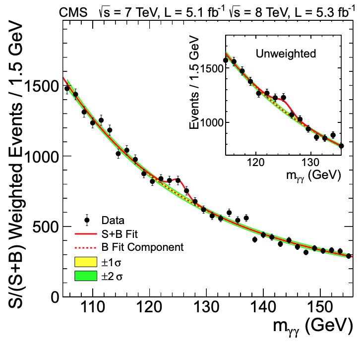

## Setup Ahead of Session
To more efficiently help with debugging, we are going to use remote access of your terminal through [tmate](https://tmate.io/). The way this application works is that you can initialize it (by calling 'tmate') and it'll start a session of your terminal that is viewable and editable online. In the website linked it shows how that looks like. If you feel comfortable letting the facilitators use this with you, follow the steps below to install tmate. 

To download this you'll have to use homebrew (another application). To check if you have homebrew installed, 
~~~bash
brew help
~~~
{: .source}

If you get some output, you're set. Otherwise it'll give you an error saying the 'brew' command doesn't exist. In that case, download [homebrew](brew.sh) by
~~~bash
/bin/bash -c "$(curl -fsSL https://raw.githubusercontent.com/Homebrew/install/master/install.sh)"
~~~
{: .source}

Once installed, use homebrew to install tmate by
~~~bash
brew install tmate
~~~

In addition, pull all the latest changes from the repositories:
~~~bash
cd ~/CMSVDAS2020/b2g-long-exercise/
git fetch --all
git pull origin gh-pages
cd ../CMSSW_11_0_1/src/
rm -rf timber-env
cmsenv
virtualenv timber-env
source timber-env/bin/activate
cd TIMBER/
git fetch --all
git checkout cmsdas_dev
python setup.py install
source setup.sh
cd ../BstarToTW_CMSDAS2020
git fetch --all
git pull origin master
~~~

## Wrapping-Up From Preselection Episode

Last session, we talked about how a preselection is useful to cut down the size of one's ntuples. Generally your preselection should include the intersection of your signal and control regions, cutting out unnecessary data. Later on, we will make further selections to optimize our signal regions and estimate the background in control regions. For this stage, using the plots we were able to make from BstarToTW_CMSDAS2020/examples/ex4.py, what is a good set of preselection cuts?

> ## Question: What should our preselection be?
> Discuss for the next ~15 minutes what the preselection for our analysis should be. Feel free to use your plots as evidence supporting your argument. 
> Think about what the preselection is supposed to be cutting on (e.g., remember to leave space for estimating the BG).
>
> > ## Solution
> >
> > The pre-selections chosen for the all-had b&#42;->tW (B2G-19-003) analysis were
> > - Standard filters and JetID
> > - pT(t), pT(W) > 400 GeV
> > - &#124;&eta;&#124; < 2.4
> > - &#124;&Delta;&phi;&#124; > &pi;/2
> > - &#124;&Delta;y&#124; < 1.6
> > - W-tga: &tau;21 < 0.4/0.45 and 65 < mSD < 105 GeV
> > - (Later) mtW > 1200 GeV
> > {: .output}
> {: .solution}
{: .challenge}

> ## Question: What is the difference between GitHub and GitLab
>
> You may have noticed that the code repositories hosting the tutorial info and the analysis code used in this exercise use different services (GitHub vs GitLab). Why is this the case?
>
> > ## Solution
> >
> > GitHub is completely public, whereas GitLab is maintained by CERN and requires credential to host projects. 
> > Depending on the needs of the project you are working on, you may want the public nature of GitLab or the speciic tools of GitLab.
> > For example, GitLab's CI/CD has additional features that are specifically useful to developing analysis software.
> {: .solution}
{: .challenge}

## Taking a Step Back: Analysis Strategy

With an idea of how we want to make out preselection, let's take a moment to think ahead to how we want to organize our analysis. 

> ## Question: How would we expect to see our signal? Is there a specific, discriminating variable we should be using in our analysis to find our signal?
> Think about what kind of signal we are looking for. Is it a resonance or not? What 
> > ## Solution
> > We are looking for an excited b-quark resonance (b&#42;). Resonances tend to appear as a 'bump' in some observable with a normally falling distribution.
> > For example, in 2012 analysis teams performed a similar strategy when searching for the scalar (Higgs) boson at 125 GeV.
> >  
> > In this example, the mass was reconstructed from the two decaying photons or muons.
> > For our signal, the mass of the b&#42; is also an observable that could help discriminate; we can reconstruct the b&#42; effective mass (mtW) from the decaying t and W.
> > {: .output}
> {: .solution}
{: .challenge}

Now that we know we will want to use mtW, we need to make a rough decision of how we are going to select for signal and estimate the background.

> ## Question: What is our general signal-selection/background-estimation strategy going to be?
> Think about what backgrounds we have, how we will estimate those, and how we can make the best selection for a signal region.
> > ## Solution
> > Disclaimer: We are guiding you through the decisions made by the All-Had b&#42;->tW analysis team, y'all are free to differ from it. This is just an example of what was done recently.
> > Our backgrounds are predominantly multi-jet QCD background (including W+Jets), and SM processes with tops+jets (ttbar and singletop). ttbar and singletop are BGs that are fairly well-modeled and we will keep their shape but allow their normalization to float when fitting parameters as the end. We will discuss fitting parameters on Tuesday's sessions.
> > A simple way would be to use a 'bump-hunt' in mtW. We can also use mt, to simultaneously define a signal region and a measurement region for QCD/W+Jets and ttbar. We will discuss this 2-D bump-hunt approach in detail in the next session.
> > We can define the signal region by further optimizing selections on our t and W candidate jets, with a window selection on the mt and bump-hunt in mtW.
> > {: .output}
> {: .solution}
{: .challenge}

## Optimizing: But How?
Perhaps when deciding the rough preselection cuts you may have already thought 'How do I make the *best* cuts to the variables available to me?' Another question of similar nature is 'how would I define what is *best*?' There are a few ways to answer these questions, but first we must decide on how we are going to define 'optimal' cuts.

> ## Question: How will we define optimal?
> What objective measure will we use to help us define an optimal selection?
>
> > ## Solution
> >
> > One (bad) way to define whether a selection is 'good' or 'bad' is by simpy asking if it cuts away more signal than it does background. 
> > The reason this is not adequate is that you want to make a selection that cuts away background at a rate that enhances the signal significance. 
> > Roughly, the significance of the signal strength can be estimated as the ratio of the signal over the square root of the dataset
> > &sigma;sig &approx; Nsig/&radic;Ntot&approx;Nsig/&radic;NBG
> > {: .output}
> {: .solution}
{: .challenge}

Going forward with this exercise, we will use the the 'S/&radic;B' approximation for significant to guide our decisions.

## Tightening Selections

Now that we understand what the minimal selection is that we want to apply to our signal and background, we need to think harder about what are the final (tighter) selections that we want to apply to define our signal and control regions.

> ## Question: What is a control region and why do we need it?
>
> What are some parts of the analysis you think could be optimized?
>
> > ## Solution
> >
> > The selections could be further tightened from what we decided for preselection. 
> >
> > {: .output}
> {: .solution}
{: .challenge}

> ## Question: What should we optimize?
>
> What are some parts of the analysis you think could be optimized?
>
> > ## Solution
> >
> > The selections could be further tightened from what we decided for preselection. 
> >
> > {: .output}
> {: .solution}
{: .challenge}

There are many variables that behave similarly in signal and the background processes, cutting on such variables may not be beneficial since you would need to cut hashly on signal to remove background. Sometimes, the variables can help discriminate more obviously but the exact value which to cut on may be hard to identify. 

> ## Question: How can we quantify an optimal selection of a variable?
>
> > ## Solution
> >
> > What we are trying to do is keep signal and reject background. 
> > The basic significance measure is signal/sqrt(BG), and we want to plot how this significance changes as you cut harder on the variables.
> > Try generating these plots and finding the values on the variables to cut on to maximize the measure of significance.
> >
> > {: .output}
> {: .solution}
{: .challenge}
