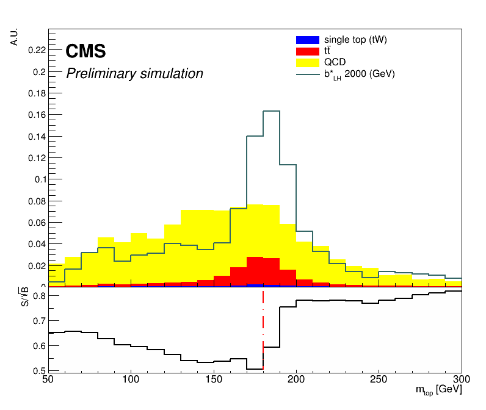

## Setup Ahead of Session
To more efficiently help with debugging, we are going to use remote access of your terminal through [tmate](https://tmate.io/). The way this application works is that you can initialize it (by calling 'tmate') and it'll start a session of your terminal that is viewable and editable online. In the website linked it shows how that looks like. If you feel comfortable letting the facilitators use this with you, follow the steps below to install tmate. 

To download this you'll have to use homebrew (another application). To check if you have homebrew installed, 
~~~bash
brew help
~~~
{: .source}

If you get some output, you're set. Otherwise it'll give you an error saying the 'brew' command doesn't exist. In that case, download [homebrew](brew.sh) by
~~~bash
/bin/bash -c "$(curl -fsSL https://raw.githubusercontent.com/Homebrew/install/master/install.sh)"
~~~
{: .source}

Once installed, use homebrew to install tmate by
~~~bash
brew install tmate
~~~

In addition, pull all the latest changes from the repositories:
~~~bash
cd ~/CMSVDAS2020/b2g-long-exercise/
git fetch --all
git pull origin gh-pages
cd ../CMSSW_11_0_1/src/
rm -rf timber-env
cmsenv
virtualenv timber-env
source timber-env/bin/activate
cd TIMBER/
git fetch --all
git checkout cmsdas_dev
python setup.py install
source setup.sh
cd ../BstarToTW_CMSDAS2020
git fetch --all
git pull origin master
~~~

## Wrapping-Up From Preselection Episode

Last session, we talked about how a preselection is useful to cut down the size of the ntuples produced/read. Generally your preselection should include the union of your signal and control regions, cutting out unnecessary data. Later on, we will make further selections to optimize our signal regions and estimate the background in control regions. For this stage, using the plots we were able to make from BstarToTW_CMSDAS2020/examples/ex4.py, let's decide on a preselection.

> ## Question: What should our preselection be?
>
> Discuss for the next ~15 minutes what the preselection for our analysis should be. Feel free to use your plots as evidence supporting your argument. 
> Think about what the preselection is supposed to be cutting on (e.g., remember to leave space for estimating the BG).
>
> > ## Solution
> >
> > The pre-selections chosen for the all-had b&#42;->tW (B2G-19-003) analysis were
> > - Standard filters and JetID
> > - pT(t), pT(W) > 400 GeV
> > - &#124;&eta;&#124; < 2.4
> > - &#124;&Delta;&phi;&#124; > &pi;/2
> > - &#124;&Delta;y&#124; < 1.6
> > - W-tga: &tau;21 < 0.4/0.45 and 65 < mSD < 105 GeV
> > - (Later) mtW > 1200 GeV
> {: .solution}
{: .challenge}

## Taking a Step Back: Analysis Strategy

With an idea of how we want to make our preselection, let's take a moment to think ahead to how we want to organize our analysis. 

> ## Question: How would we expect to see our signal? Is there a specific, discriminating variable we should be using in our analysis to find our signal?
> Think about what kind of signal we are looking for. Is it a resonance or not? What 
> > ## Solution
> > We are looking for an excited b-quark resonance (b&#42;). Resonances tend to appear as a 'bump' in some observable with a normally falling distribution.
> > For example, in 2012 analysis teams performed a similar strategy when searching for the scalar (Higgs) boson at 125 GeV.
> >  
> > In this example, the mass was reconstructed from the two decaying photons or muons.
> > For our signal, the mass of the b&#42; is also an observable that could help discriminate; we can reconstruct the b&#42; effective mass (mtW) from the decaying t and W.
> > {: .output}
> {: .solution}
{: .challenge}

Now that we know we will want to use mtW, we need to make a rough decision of how we are going to select for signal and estimate the background.

> ## Question: What is our general signal-selection/background-estimation strategy going to be?
>
> Think about what backgrounds we have, how we will estimate those, and how we can make the best selection for a signal region.
>
> > ## Solution
> >
> > Disclaimer: We are guiding you through the decisions made by the All-Had b&#42;->tW analysis team, y'all are free to differ from it. This is just an example of what was done recently.
> > Our backgrounds are predominantly multi-jet QCD background (including W+Jets), and SM processes with tops+jets (ttbar and singletop). ttbar and singletop are BGs that are fairly well-modeled and we will keep their shape but allow their normalization to float when fitting parameters as the end. We will discuss fitting parameters on Tuesday's sessions.
> > A simple way would be to use a 'bump-hunt' in mtW. We can also use mt, to simultaneously define a signal region and a measurement region for QCD/W+Jets and ttbar. We will discuss this 2-D bump-hunt approach in detail in the next session.
> > We can define the signal region by further optimizing selections on our t and W candidate jets, with a window selection on the mt and bump-hunt in mtW.
> {: .solution}
{: .challenge}

## Optimizing: But How?
Perhaps when deciding the rough preselection cuts you may have already thought 'How do I make the *best* cuts to the variables available to me?' Another question of similar nature is 'how would I define what is *best*?' There are a few ways to answer these questions, but first we must decide on how we are going to define 'optimal' cuts.

> ## Question: How will we define optimal?
> What objective measure will we use to help us define an optimal selection?
>
> > ## Solution
> >
> > One (bad) way to define whether a selection is 'good' or 'bad' is by simpy asking if it cuts away more signal than it does background. 
> > The reason this is not adequate is that you want to make a selection that cuts away background at a rate that enhances the signal significance. 
> > Roughly, the significance of the signal strength can be estimated as the ratio of the signal over the square root of the dataset
> > &sigma;sig &approx; Nsig/&radic;Ntot&approx;Nsig/&radic;NBG
> {: .solution}
{: .challenge}

Going forward with this exercise, we will use the the 'S/&radic;B' approximation for significant to guide our decisions.

## Tightening Selections

Now that we understand what the minimal selection is that we want to apply to our signal and background, we need to think harder about what are the final (tighter) selections that we want to apply to define our signal and control regions.

> ## Question: What are some parts of the analysis you think could be optimized?
>
> In addition to the preselection, we can make selections on the top and W bosons to ensure an enriched signal region.
> 
> > ## Solution
> >
> > As mentioned above, the pre-selections chosen for the all-had b&#42;->tW (B2G-19-003) analysis were
> > - Standard filters and JetID
> > - pT(t), pT(W) > 400 GeV
> > - &#124;&eta;&#124; < 2.4
> > - &#124;&Delta;&phi;&#124; > &pi;/2
> > - &#124;&Delta;y&#124; < 1.6
> > - W-tga: &tau;21 < 0.4/0.45 and 65 < mSD < 105 GeV
> > - (Later) mtW > 1200 GeV
> >
> > Our selections should at-least be this tight. In addition to these selections, the SR of their analysis is defined by a top tag of
> > - &tau;32 < 0.65
> > - mSD window of [105,220]
> > - deepCSVsubjet < 0.22(2016)/0.15(2017)/0.12(2018)
> > More specifically, the B2G-19-003 team included the mtW > 1200 GeV cut in the later selections and defined the SR W-tagged jet as one that is not top-tagged but passes the preselection cuts. 
> > In the case that the two leading jets are top-tagged, this region was used as a ttbar measurement (control) region.
> > 
> > Do we want to use similar selections? Try looking into these distributions and make your own call!
> {: .solution}
{: .challenge}

## 'N minus 1' Plots

One powerful analysis tool for optimization are what are referred to as 'N minus 1' plots. These are plots of distributions used in series of selections, systematically omitting one selection of the series at a time and plotting that varibale. N-1 plots can help us understand the impact of tightening cuts on the variable. Normally, we 'tighten' selections and want to know how our significance estimate changes as a function of 'tighening'. The direction of 'tight' depends on the observable at hand, for example toward 0 for &tau;32 and towards infinity for jet pT.

> ## Question: How would you define tight for a mass peak?
>
> > ## Solution
> >
> > Normally we use a one-sided selections, but for a mass peak we may want to make a window requirement.
> >  
> > The closer you are to the taregt mass the tighter. Thus, you would have to make a decision on what the target mass should be (note this could differ from the ideal mass) for use as the upper limit of the significance estimation.
> {: .solution}
{: .challenge}

Give it a shot yourself, type the following into your terminal from the BstarToTW_CMSDAS2020 directory
~~~bash
python exercises/nminus1.py -y 16  --select
~~~
This should create some example plots for the selections used by the B2G-19-003 analysis team. Change the selections applied to what you have decided upon today to checkout the impact of your cuts. Is your selection optimal? Use the remaining time to produce and look into these plots to come up with a signal region selection.
