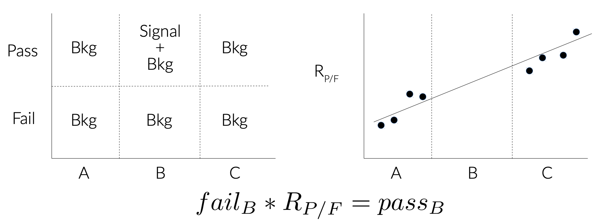

## Backgrounds to the Analysis
 
We begin understanding our background by considering the final state of the signal. The excited b decays to a top quark and a W boson, where the decays of both are to several jets.

There are are a few Standard Model processes that can lead to a top+W-like experimental signature:
-- Multi-jet QCD: The nature of the LHC means hadronic background is given for any analysis that does not have a lepton or missing energy to flag. The reason we get large masses in W/t-candidates is that jets cluster *any* PF candidate within the R-parameter, and with enough momentum and/or distance between PF candidates these QCD events can create a large-mass jet.
-- W+Jets: This process is when a single W-boson is produced in association to QCD jets. Since the preselection identifies the true W, the process become a background to our signal through its associated jets. Thus, we can include the process as part of the 'QCD' (stochastic jets) background contibution.
-- ttbar: The simplest way this process can enter our signal region is a fully-hadronic decay, where one of the b-quarks is either soft or not identified with our b-tagging. It can also happen that the top has a large decay opening-angle and the W decay is captured in a large-R jet separate from the associated b-quark. 
-- singletop: The Standard Model can have a pair of protons produce a single top in association to a (usually heavy) quark or W-boson. In our case the top produced with a W becomes an irreducible background, however less dominant than the above processes.

## Control Regions

Just as signal regions are defined by selections meant to enrich a measurement in signal while eliminating as much background as possible, a control regions are defined by selections meanto to enrich a measurment with a particular background and rejecting as much signal as possible. The idea behind control regions are to provide a kinematic region which is orthogonal but 'close' to the signal region, where a particular background is dominant; the MC is then adjusted to match the data in that region and then an extrapolation is done to approximate the MC scalings needed in the signal region to appropriately model the data. The extrapolation could be a single 'Scale Factor', or a more sophisticated 'Transfer Function'

> ## Question: Can you come up with a rough idea for Control Region for any of our background?
>
> > ## Solution
> >
> > ttbar is arguably the easiest to define a control region for: require having two top-tags.
> > singletop is an irrducible background, it truly has a t and W in the final state. To develop a CR for it one would have to find fine differences in production kinematics, however its sub-dominance to the other BGs makes having a dedicated CR not time-efficient.
> > Multi-Jet Production: The process has a falling distribution across mtop and mtW. The MC is not well-modeled. The best way to model this is to fit a polynomial to the data that extends in both axes. We can measure all parts against data everywhere but the signal region, where we would extrapolate from our fit.
> > W+Jets: Since the signal region is defined by a top-tag, the background in mtop-mtW space behaves like multi-jet production. We could fit this background simultaneously to the QCD. 
> {: .solution}
{: .challenge}

The figure below communicates how the various signal and background regions relate to each other though selections, and how (this particular) transfer function is defined from ratios of pass/fails in the regions.

> ## Question: What is the variable represented here by the x-axis? What do the regions A/B/C represent, and what the are selections dividing them? What does 'pass' and 'fail' refer to?
>
> > ## Solution
> >
> > We can start with the pass/fail, which refers to the top tag. The x-axis is mtop, meaning the regions A/B/C are different mass ranges: A is low-mass, B is the top-mass window, and C is high-mass.
> {: .solution}
{: .challenge}

## Need for Data Driven Background Estimation

QCD modeling is notoriusly hard to model. One strategy to modeling processes that are not well simulated is to remove the effect of well-modeled processes from data, then creating a shape template on which to match the poor-modeled background. This approach to estimating the background is called data-driven estimation. 

> ## Question: What background processes to our signal would be good candidates for data-driven estimation?
>
> > ## Solution
> >
> > Multi-jet QCD is almost always estimated using a data-driven technique. In addition, the W+Jets process has a QCD-formed top candidates. ttbar and singletop are relatively well-modeled, however the normalization of their distributions are allowed to float in the final parameter fit.
> {: .solution}
{: .challenge}
