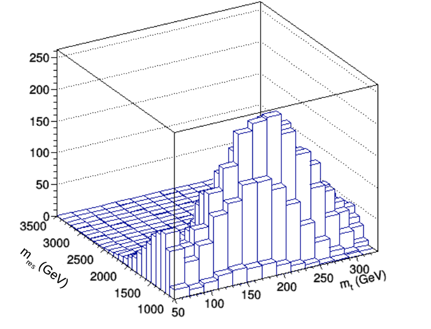
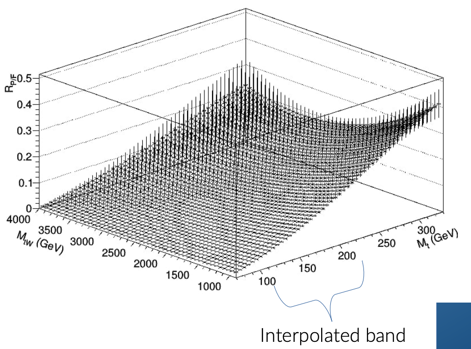
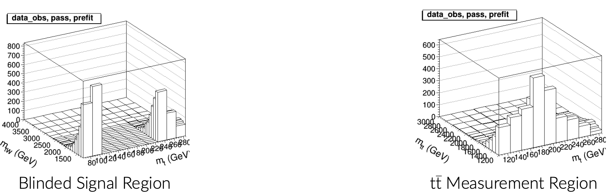

Recording files of this session are in [cernbox](https://cernbox.cern.ch/index.php/s/uibnZgUrfC0HAqn)

## Idea of 2D Alphabet
Normally, we do a shape hunt along some observable and measure our background is near-by kintemtic regions to estimate its expected yield in the signal region. For our case, there is a clever way to do all these tasks simultaneously. Since we are scanning across mtW, with a window designated as a Signal Region, we can use all the non-window space to fit a smooth function that extrapolates over the SR window.
 

Since we define our SR as passing exactly one top tag (most importantly with a mass window cut), we can use the adjacent region of passing 2 top tags for a ttbar/singletop constrol region. We can then use the smooth function from above to estimate the multi-jet contribution to the 2-top measurement region. Whereas the multi-jet contribution's shape is determined by the smooth function fit, the shape of the ttbar and singletop background is set by simulation and the normalization is allowed to float.

 

## Simultaneous Fit
The fitting of the multi-jet background as well as the ttbar/singletop measurement are all done simultaneously. As the multijet estimation fit optimizes, the ttbar/singletop region feeds back its normalizations to subtract from the data used in the fit optimization. We also perform the fits separately but simultaneously across years (2016-2018).
In summary, the fits are done on 3 years x 2 pass/fail x 2 multi-jet/ttbar (1/2-top) = 12 2D-regions (mt, mtW). 

 

## Exercise: Try Plotting CR and Get Familiar with 2DAlphabet
At tomorrow's sessions you will dive into using 2DAlphabet for your own selections. For now, use the exisig code in BstarToTW_CMSDAS2020/examples/ex4.py to generate your own plots with selections meant for the ttbar and multi-jet CRs. You'll need to mmodify the script and run the --select flag to make the new root files used for the plotting. As is, the script plots MC-only, can you add data to the CR plots? 

Use the remaining time in the session to wrap up work in previous sessions, tomorrow we will run the 2DAlphabet framework to produce our limits. Also try looking into the [2DAlphabet](https://github.com/lcorcodilos/2DAlphabet/blob/master/TwoDAlphabetClass.py) framework to get an idea of how the code is structured and how you will change it tomorrow. Feel free to ask the facilitators any questions you have!
